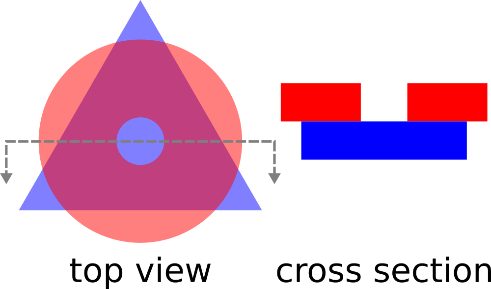

## Overview

The purpose of this exercise is to get used to working with shapely polygons and to use it to compute some manufacturing geometry.  It is your job to determine how to compute the cut files using Python, shapely, and the foldable_robotics package

## Detailed Procedure

You have been given the goal of making the  2-layer laminate device shown in Figure 1:

{height=2in}

1. Update your foldable robotics package:
```
pip uninstall foldable_robotics
pip install foldable_robotics
```

1. Create the two-layer design by creating each of the two shapes as two separate shapely polygons.  Plot them in the same plot using matplotlib, using transparency and color to differentiate the layers.  This *could* be done a number of ways:
    * extracting the points directly from shapely and plotting using the matplotlib.pyplot.fill command,
    * by embedding shapely geometries in a Layer object and using the Layer.plot() method with color specified, or
    * by embedding two Layer objects in a Laminate object and using the Laminate.plot() method, which automatically assigns colors.  

    **Please use the third method if you are starting fresh**

1. Define the rectangular sheets of material from which each layer is originally cut.  Both layers' sheets should be identical sizes.  The sheets should be larger than the devices.  The device should be located in the center of the sheets.  Plot the resulting laminate.

1. Compute the laser "keepout" of the device.  Remember, this is the area you must not cut in order to protect your device, given laser-based cutting assumptions(that lasers cut through everything). Plot the resulting laminate.

1. Use the laser keepout definition from class to define a valid second-pass cut.  From that, compute the scrap which remains after the release(second-pass) cut and plot the resulting laminate.

1. Using the equation $Sheet=Scrap_{firstpass} \cup Scrap_{secondpass} \cup Device$ , compute the first pass cut and plot the resulting laminate.

<!--1. Repeat steps 3-5 assuming CNC milling, with a relatively small but non-zero-diameter mill.( Try just a bit smaller than the center hole in the top figure.)  Describe the major differences in your computation and the result.-->

Detail these steps in your writeup.  This should be submitted as a jupyter notebook file.

## Suggestions
* to set the color of a Layer object called "layer1" to red(1,0,0,1) try:
```{python}
layer1.plot(color=(1,0,0,1),new=True)
```
* use the keyword argument new=True when plotting layers or laminates to automatically generate a new figure. 
